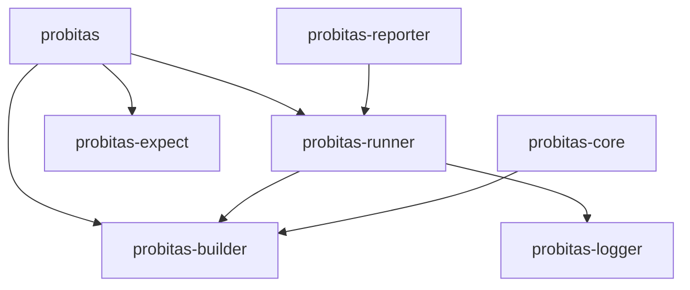

# Package Structure

Workspace organization and dependency management for Probitas.

## Directory Layout

```
probitas/
├── deno.jsonc                    # Root workspace config
├── packages/
│   ├── probitas/                 # @probitas/probitas - Primary library (user-facing API)
│   ├── probitas-builder/         # @probitas/builder - Type-safe scenario definition
│   ├── probitas-runner/          # @probitas/runner - Scenario execution engine
│   ├── probitas-reporter/        # @probitas/reporter - Output formatters
│   ├── probitas-core/            # @probitas/core - Scenario loading/filtering
│   ├── probitas-discover/        # @probitas/discover - File discovery
│   ├── probitas-expect/          # @probitas/expect - Expectation library
│   └── probitas-logger/          # @probitas/logger - Logging utilities
└── probitas/                     # Example scenarios
```

Note: The CLI is maintained in a
[separate repository](https://github.com/jsr-probitas/cli).

## Package Hierarchy



## Dependency Management

- **Workspace-level dependencies**: All dependencies are managed in the
  workspace root `deno.jsonc`. Individual package `deno.json` files should not
  contain `imports` or `scopes`.
- **JSR protocol for internal deps**: Use `jsr:@probitas/xxx@^0` for
  inter-package dependencies (workspace root provides path overrides for
  development)
- Root `deno.jsonc` contains: workspace definition, all project dependencies,
  shared dev dependencies (testing), and local path overrides for development.
