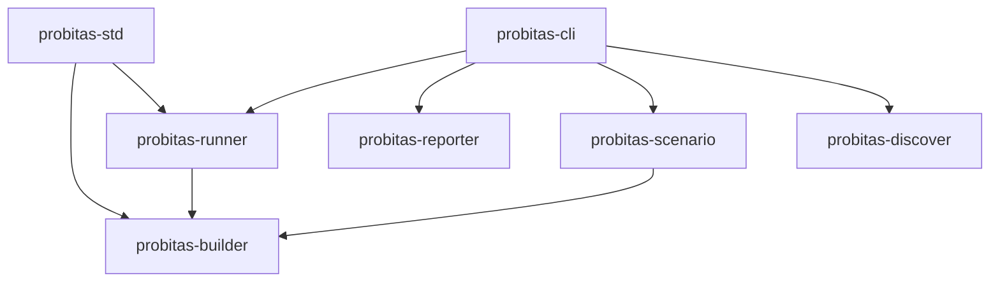

# Probitas

Scenario-based testing and workflow execution framework for Deno.

## Project Overview

- **Runtime**: Deno 2.x
- **Package Registry**: JSR (`@probitas/*` namespace)
- **Framework Type**: Scenario-based testing framework

## Package Structure

```
probitas/
├── deno.jsonc                    # Root workspace config
├── packages/
│   ├── probitas-std/             # @probitas/std - Standard library (user-facing API)
│   ├── probitas-builder/         # @probitas/builder - Type-safe scenario definition
│   ├── probitas-runner/          # @probitas/runner - Scenario execution engine
│   ├── probitas-reporter/        # @probitas/reporter - Output formatters
│   ├── probitas-scenario/        # @probitas/scenario - Scenario loading/filtering
│   ├── probitas-discover/        # @probitas/discover - File discovery
│   └── probitas-cli/             # @probitas/cli - Command-line interface
└── example/                      # Example scenarios
```

### Package Hierarchy



## Development Patterns

### Module Organization

- **Single entry point**: Each package exports through `mod.ts`
- **Use `export *`**: Prefer `export *` over explicit `export { ... }` in mod.ts
- **Type-only exports**: Use `export type *` for types (tree-shaking)
- **Colocated tests**: `*_test.ts` files adjacent to implementation

### Package Config (deno.json)

```json
{
  "name": "@probitas/{package-name}",
  "version": "0.0.0",
  "exports": "./mod.ts",
  "publish": {
    "exclude": ["**/*_test.ts", "**/*_bench.ts"]
  }
}
```

### Dependency Management

- **Workspace-level dependencies**: All dependencies are managed in the
  workspace root `deno.jsonc`. Individual package `deno.json` files should not
  contain `imports` or `scopes`.
- **JSR protocol for internal deps**: Use `jsr:@probitas/xxx@^0` for
  inter-package dependencies (workspace root provides path overrides for
  development)
- Root `deno.jsonc` contains: workspace definition, all project dependencies,
  shared dev dependencies (testing), and local path overrides for development.

### User-Facing API

The `@probitas/std` package is the primary user-facing API:

```typescript
import { scenario, Skip } from "probitas";

export default scenario("My Test")
  .step("Step 1", () => ({ value: 42 }))
  .step("Step 2", (ctx) => {
    if (ctx.previous.value !== 42) throw new Error();
  })
  .build();
```

Key exports from `@probitas/std`:

- `scenario` - Scenario builder function (from `@probitas/builder`)
- `Skip` - Skip class for conditional skipping (from `@probitas/runner`)
- `StepContext` - Type for step context (from `@probitas/builder`)

### Implementation Style (T-Wada Style)

Follow test-driven development principles:

1. Write a failing test first
2. Write minimal code to make the test pass
3. Refactor while keeping tests green
4. Repeat

### Testing Strategy

**Unit Tests (`*_test.ts`)**

- Test in isolation without external dependencies
- Run with `deno task test`

**Example Scenarios (`example/`)**

- Example scenarios for documentation and manual testing
- Files named `*.scenario.ts`
- Run with `deno task cli run`

## Commands

```bash
deno task check       # Type check all files
deno task verify      # Run format, lint, type check and tests
deno task test        # Run tests (parallel, shuffled)
deno task test:coverage  # Run tests with coverage
deno task coverage    # Generate coverage report
deno task cli         # Run the CLI (e.g., deno task cli run)
```

---

## STRICT RULES (MUST FOLLOW)

### 1. Git Commit Restriction

**NEVER commit without explicit user permission.**

- Commits are forbidden by default
- Only perform a commit ONCE when the user explicitly grants permission
- After committing, MUST recite this rule:
  > "Reminder: Commits are forbidden by default. I will not commit again unless
  > explicitly permitted."

### 2. Backup Before Destructive Operations

**ALWAYS create a backup before any operation that may lose working tree
state.**

Examples requiring backup:

- `git restore`
- `git reset`
- `git checkout` (switching branches with uncommitted changes)
- `git stash drop`
- Any file deletion or overwrite of uncommitted work

### 3. Pre-Completion Verification

BEFORE reporting task completion, run ALL of the following and ensure zero
errors/warnings:

```bash
deno task verify
```

### 4. English for Version-Controlled Content

**Use English for ALL content tracked by Git:**

- Code (variable names, function names)
- Comments
- Documentation (README, CLAUDE.md, etc.)
- Commit messages
- Error messages in code

### 5. Stay in Worktree During Worktree Tasks

**NEVER leave the worktree directory when working on a worktree task.**

- If you start work in `.worktrees/{branch}/`, ALL operations must stay there
- Do NOT `cd` to the root repository or other directories
- Run all commands (git, deno, etc.) from within the worktree
- If you need to check the root repository state, use absolute paths without
  changing directory

### 6. Git Stash is Forbidden in Worktrees

**NEVER use `git stash` in worktree environments.**

Git stash is shared across all worktrees. This causes accidental cross-worktree
contamination.

**Use backup branch instead:**

```bash
git checkout -b "backup/$(git branch --show-current)/$(date +%Y%m%d-%H%M%S)"
git commit -am "WIP: before risky refactoring"
git checkout -
git cherry-pick --no-commit HEAD@{1}
```

This creates a persistent backup branch while keeping changes in your working
tree.
