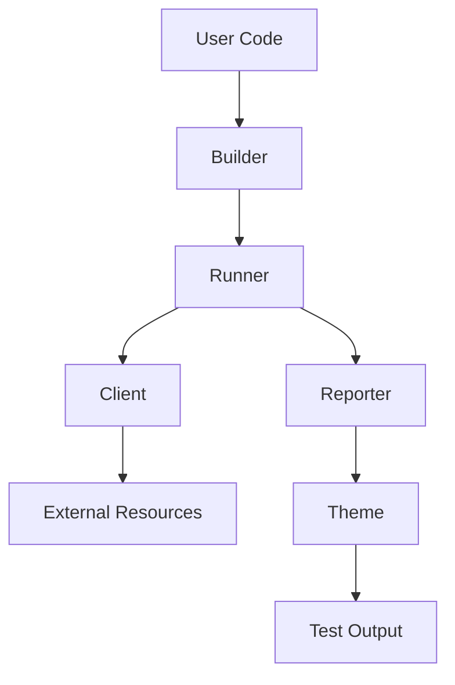
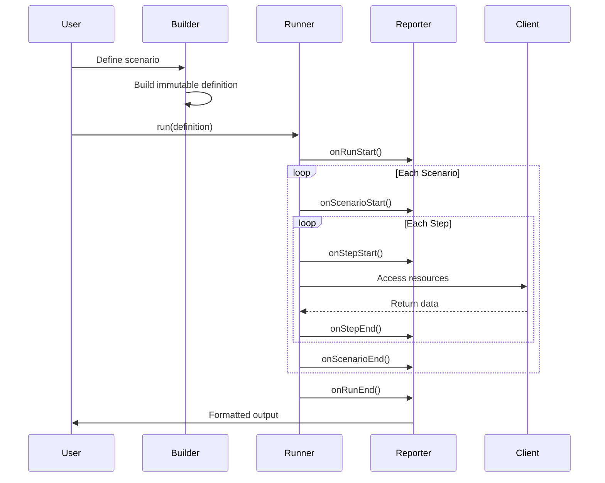
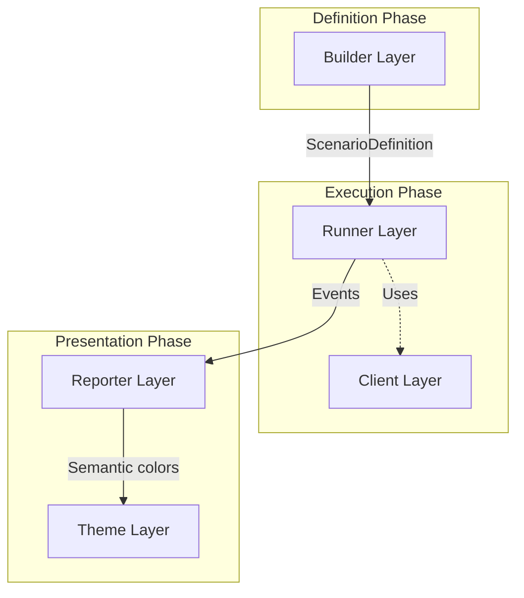

# Probitas Architecture

Probitas is a scenario-based testing framework designed with a 5-layer
architecture that achieves separation of concerns.

## Overview

Probitas 5-layer architecture:



Each layer has a single responsibility, achieving separation of concerns.

## 5 Core Layers

### 1. Builder Layer

**Responsibility**: Type-safe test scenario definition API

The Builder layer transforms user intent into immutable scenario definitions
using a fluent API with compile-time type checking.

**Key Capabilities**:

- Fluent API that enables compile-time type checking
- Automatic type inference for result types throughout the chain
- Captures scenario structure without executing tests
- Generates immutable scenario definitions

See [Builder Specification](./builder.md) for detailed API and usage examples.

### 2. Runner Layer

**Responsibility**: Scenario execution and test lifecycle orchestration

The Runner layer executes scenario definitions and manages the complete test
lifecycle.

**Key Capabilities**:

- Receives scenario definitions from Builder
- Executes scenario entries (steps, resources, setups) in order
- Controls parallel/sequential execution
- Provides abort/timeout control
- Coordinates with Reporter for output

See [Runner Specification](./runner.md) for detailed API and usage examples.

### 3. Reporter Layer

**Responsibility**: Format and display test results

The Reporter layer receives lifecycle events from Runner and presents them to
users in various formats.

**Key Capabilities**:

- Receives lifecycle events from Runner
- Uses Theme layer to format output semantically
- Supports multiple output formats (List, TAP, JSON, Live, Dot)
- Enables custom reporters

See [Reporter Specification](./reporter.md) for detailed API and usage examples.

### 4. Theme Layer

**Responsibility**: Provides semantic coloring for the Reporter layer

The Theme layer separates visual representation from business logic, enabling
customizable output.

**Key Capabilities**:

- Abstracts coloring logic used by Reporters
- Defines colors based on semantics (success, failure, skip, etc.)
- Supports NO_COLOR environment variable
- Supports custom themes

See [Theme Specification](./theme.md) for detailed API and usage examples.

### 5. Client Layer

**Responsibility**: Ergonomic access to external resources

The Client layer provides high-level, type-safe APIs for interacting with
external resources.

**Key Capabilities**:

- Provides high-level APIs for common operations
- Manages resource lifecycle (connection, cleanup)
- Implements explicit resource management (AsyncDisposable)
- Provides type-safe interfaces

See [Client Specification](./client.md) for detailed API and usage examples.

## Execution Flow



1. **Definition**: User creates scenario definitions with Builder layer
2. **Execution**: Runner receives definitions and executes steps
3. **Reporting**: Runner sends lifecycle events to Reporter layer
4. **Resource Access**: Steps use Client layer to interact with external
   resources
5. **Display**: Reporter uses Theme layer to format and display results

## Layer Interaction



## Design Principles

### Separation of Concerns

| Layer    | What            | How                     | Why                       |
| -------- | --------------- | ----------------------- | ------------------------- |
| Builder  | Test Structure  | Type-safe Fluent API    | Compile-time safety       |
| Runner   | Test Execution  | Lifecycle orchestration | Execution flexibility     |
| Reporter | Test Output     | Event-based formatting  | Multiple output formats   |
| Theme    | Output Coloring | Semantic abstraction    | Flexible UI customization |
| Client   | Resource Access | High-level abstraction  | Reusable integrations     |

### Key Principles

1. **Single Responsibility**: Each layer has one clear responsibility
2. **Type Safety**: Compile-time guarantees with TypeScript's type system
3. **Immutability**: Scenario definitions are immutable after building
4. **Semantic Design**: Theme layer prevents Reporters from depending on color
   implementation details
5. **Extensibility**: Supports custom reporters, themes, clients, and execution
   strategies
6. **Resource Management**: Automatic cleanup through explicit resource
   management
7. **Composability**: Small, focused components that work together

## Extensibility

Each layer supports customization through well-defined interfaces:

- **Custom Reporter**: Implement the `Reporter` interface - see
  [Reporter Specification](./reporter.md#customizationextension)
- **Custom Theme**: Implement the `Theme` interface - see
  [Theme Specification](./theme.md#customizationextension)
- **Custom Client**: Implement `AsyncDisposable` - see
  [Client Specification](./client.md#customizationextension)

## Quick Start

### Basic Usage

```typescript
import { scenario, ScenarioRunner } from "probitas";

// 1. Define scenario (Builder layer)
const definition = scenario("User Flow")
  .step("Get User ID", () => 123)
  .step("Fetch User", (ctx) => ({ id: ctx.previous, name: "John" }))
  .build();

// 2. Execute (Runner layer)
const runner = new ScenarioRunner();
const summary = await runner.run([definition]);

console.log(`${summary.passed}/${summary.total} passed`);
```

### Advanced Usage

```typescript
import { client, ListReporter, scenario, ScenarioRunner } from "probitas";

// With custom reporter, parallel execution, and HTTP client
const definition = scenario("API Test")
  .step("Create User", async () => {
    await using api = client.http("https://api.example.com");
    const result = await api.post("/users", { json: { name: "John" } });
    return result.json.id;
  })
  .step("Fetch User", async (ctx) => {
    await using api = client.http("https://api.example.com");
    const result = await api.get(`/users/${ctx.previous}`);
    return result.json;
  })
  .build();

const runner = new ScenarioRunner();
const summary = await runner.run([definition], {
  reporter: new ListReporter(),
  maxConcurrency: 5, // Limit parallel execution to 5 scenarios
  maxFailures: 0, // Continue all (0 means no limit, 1 = fail fast, N = stop after N failures)
});
```

## Layer Specifications

For detailed information about each layer:

- [Builder Specification](./builder.md) - Test scenario definition
- [Runner Specification](./runner.md) - Test execution engine
- [Reporter Specification](./reporter.md) - Test result output
- [Theme Specification](./theme.md) - Coloring and UI customization
- [Client Specification](./client.md) - External resource access
