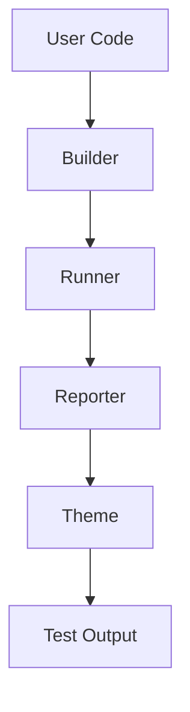
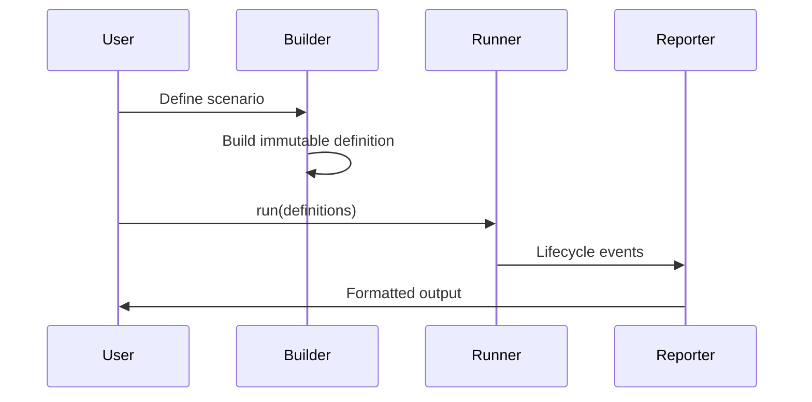

# Architecture

Probitas is a scenario-based testing framework with a 4-layer architecture that
achieves separation of concerns.

## Layer Overview

| Layer                     | Responsibility                  |
| ------------------------- | ------------------------------- |
| [Builder](./builder.md)   | Type-safe scenario definition   |
| [Runner](./runner.md)     | Execution and lifecycle control |
| [Reporter](./reporter.md) | Result formatting and display   |
| [Theme](./theme.md)       | Semantic coloring abstraction   |

## Design Principles

1. **Single Responsibility** - Each layer has one clear purpose
2. **Immutability** - Scenario definitions are immutable after building
3. **Type Safety** - Compile-time guarantees via TypeScript's type system
4. **Semantic Abstraction** - Theme layer decouples reporters from color details
5. **Extensibility** - Custom reporters and themes via well-defined interfaces

## Data Flow

1. **Definition Phase** - Builder transforms user code into `ScenarioDefinition`
2. **Execution Phase** - Runner executes definitions, emitting lifecycle events
3. **Presentation Phase** - Reporter formats events using Theme for output

## Entry Types

Scenarios consist of three entry types, executed in definition order:

| Entry      | Purpose                    | Cleanup Mechanism         |
| ---------- | -------------------------- | ------------------------- |
| `step`     | Test logic with assertions | None                      |
| `resource` | Lifecycle-managed objects  | Automatic via Disposable  |
| `setup`    | Side effects with cleanup  | Returned cleanup function |

Cleanup always runs in reverse definition order, even on failure.

## Usage

See [Guide](../guide.md) for practical usage examples.

See [Command Reference](../command.md) for command-line interface.
